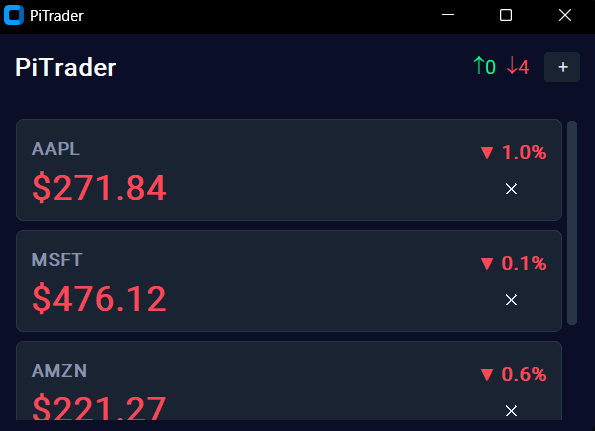
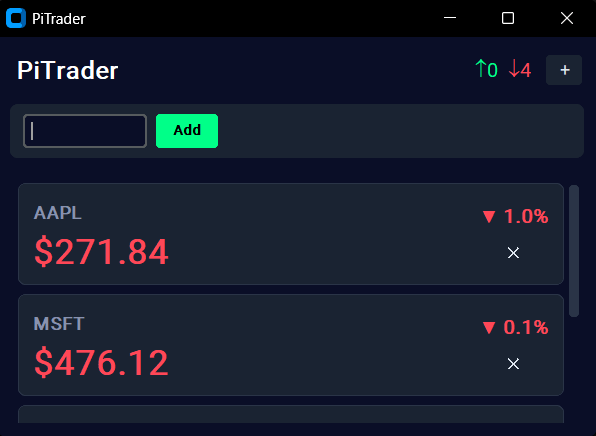

# Pi Trader - Raspberry Pi-Based Stock Trader



Pi Trader is a small, lightweight stock tracking app. Utilizing [Finnhub](https://finnhub.io/) to power it, Pi Trader refreshes once every five seconds to report accurate stock data. Users can add or remove stocks from their portfolio, and continuously monitor price changes throughout the day. Users cannot trade stocks on Pi Trader.

## Installation

Use the provided requirements.txt file to install the necessary packages. This can be done running the following command

```bash
pip install -r requirements.txt
```

## Usage

To add a stock to your portfolio, click the small '+' button in the upper left. From here, a text box will pop up, where users can insert their desired stock ticker symbol. If a symbol is invalid, you will see 'INVALID' below the added ticker instead of a price.



To remove a stock from your portfolio, click the small  'x' symbol next to the stock you would like to remove.

Pi Trader records your total positive stocks for the day, as well as your total negative trades for the day, both of which can be found in the top right.
